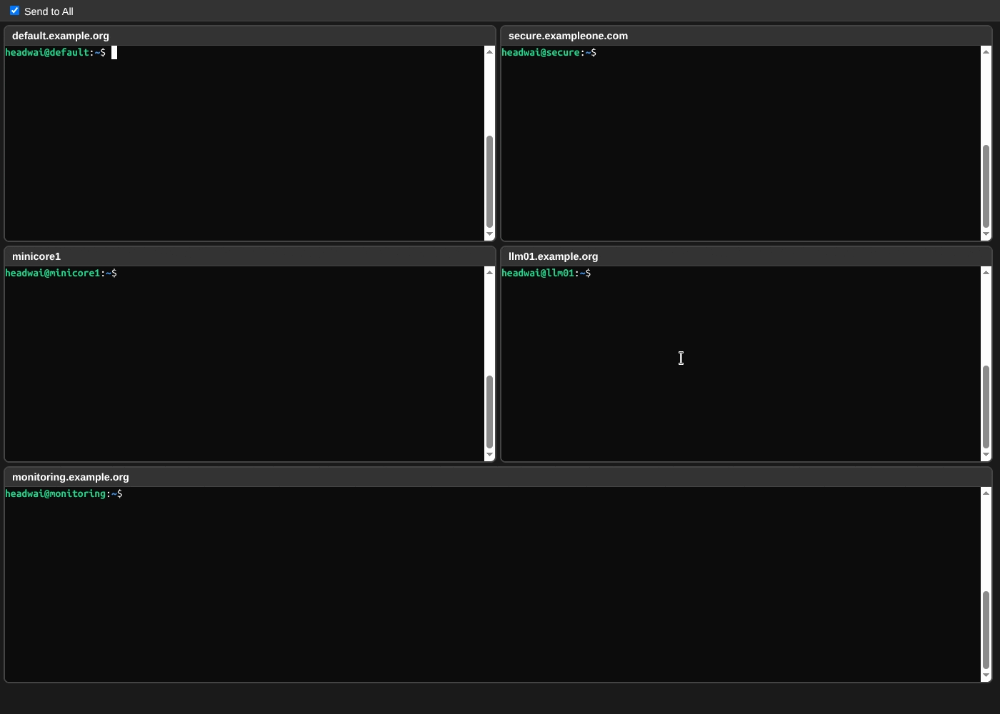

# Multi SSH

A multi-SSH terminal application built with Electron, providing a unified interface to manage multiple SSH connections simultaneously using xterm.js for terminal emulation and node-pty for pseudo-terminal support.




## Features

- **Multi-Terminal Interface**: Connect to multiple SSH hosts in separate terminal panes
- **Real Terminal Emulation**: Full shell integration with proper PTY support
- **Modern UI**: Dark-themed interface with responsive design
- **Send to All**: Option to broadcast commands to all connected terminals

## Configuration

Create a `multi_ssh_config.yaml` file based on `multi_ssh_config.sample.yaml` with your SSH hosts:

```yaml
hostGroups:
  someHosts:
    - host1
    - host2
  otherHosts:
    - host2
    - host3
```

The config file can be stored in the following locations:
1. current working directory (`./`)
1. user home directory (`~/`)
1. `/etc/multissh/multi_ssh_config.yaml`

The fist found config is used.

## Development Notes

### Prerequisites

https://www.npmjs.com/package/node-pty

#### Linux

```bash
sudo apt install -y build-essential
```

### Commands

```bash
npm install    # Installing all dependencies
npm run start  # Development Mode
npm run build  # Building the Application
npm run dist   # Creating Distribution Package
```

### Project Structure

```
multi-ssh/
├── main.js                 # Main Electron process with PTY integration
├── renderer.js             # Renderer process with xterm.js terminals
├── index.html              # Main UI layout
```

## License

MIT

[SSH icons created by Freepik - Flaticon](https://www.flaticon.com/free-icons/ssh)
